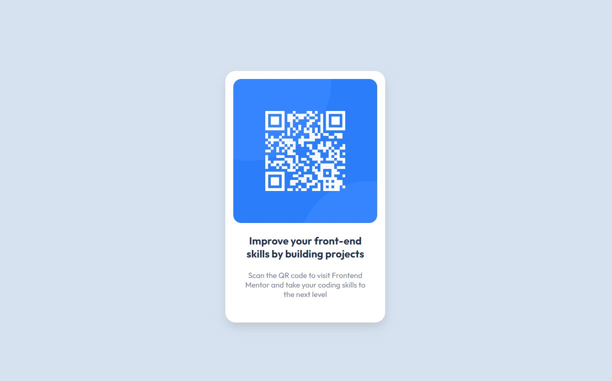

# Frontend Mentor - QR code component solution

This is a solution to the [QR code component challenge on Frontend Mentor]. Frontend Mentor challenges help you improve your coding skills by building realistic projects. 

## Table of contents

- [Overview](#overview)
  - [Screenshot](#screenshot)
  - [Links](#links)
- [My process](#my-process)
  - [Built with](#built-with)
- [Author](#author)

## Overview
### Screenshot

## My process
### Built with
- Semantic HTML5 markup
- CSS Grid
- Mobile-first workflow

### Links

- Solution URL: [https://github.com/kisznera/QR-Code-Component](https://github.com/kisznera/QR-Code-Component)
- Live Site URL: [https://kisznera.github.io/QR-Code-Component/](https://kisznera.github.io/QR-Code-Component/)

## Author

- Website - [Antal Kiszner](https://kisznerantal.hu)
- Frontend Mentor - [@kisznera](https://www.frontendmentor.io/profile/kisznera)